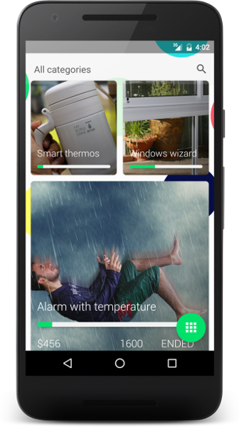
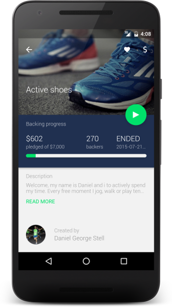
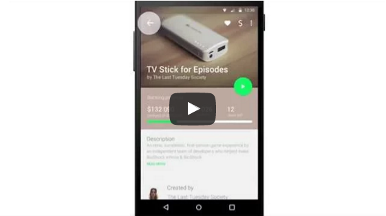
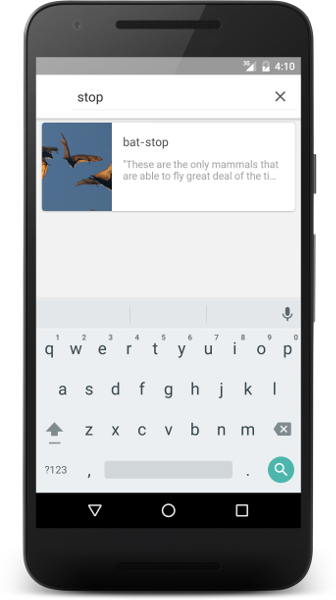
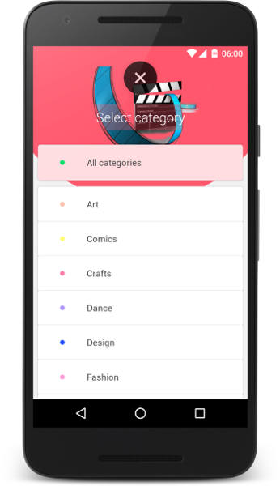
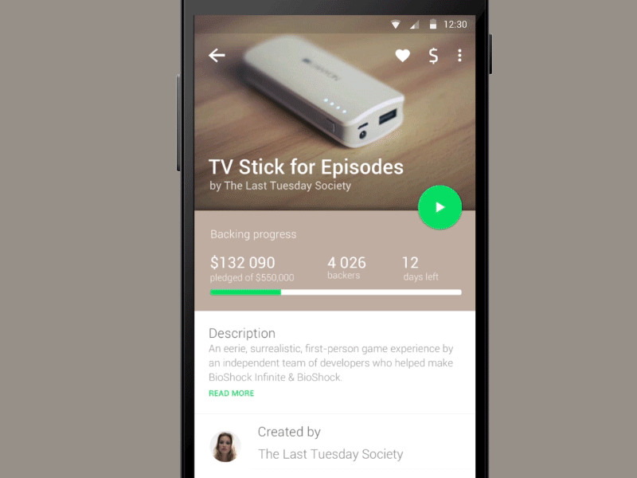

# KickMaterial
 master:  [](https://travis-ci.org/byoutline/kickmaterial)
 develop: [](https://travis-ci.org/byoutline/kickmaterial)
 [](http://androidweekly.net/issues/issue-193)

Crowdfunding app concept for Android. Created to showcase new trends in Android development with strong focus on Material Design.
For newest versions of libs check the *develop* branch.

Designed and implemented by [Outline](http://byoutline.com).





## Used libs and technologies
* [Material design](https://design.google.com/) - with custom activity transitions, FAB, pallete, etc
* [Android data binding](https://developer.android.com/tools/data-binding/guide.html)
* [Dagger 2](https://google.github.io/dagger/) - with multiple modules
* [OttoCachedField](https://github.com/byoutline/OttoCachedField)
* [Retrofit](https://square.github.io/retrofit/)
* [AndroidStubServer](https://github.com/byoutline/AndroidStubServer)
* [Spock tests](http://spockframework.org/)
* [BindingCollectionAdapter](https://github.com/evant/binding-collection-adapter/)
* EndlessRecyclerView

## Mock API
Application shows data from Mocked API. This is a simple HTTP server started with app on device.
All data are being served by AndroidStubServer library based on configuration files placed in assets/mock/ directory. If you want to see configuration of API go to config.json file.

## Project setup
This project uses [Retrolambda](https://github.com/orfjackal/retrolambda).
If your build fails on `compileRetrolambdaDebug` or `compileDebugJavaWithJavac`
please ensure that you have both Java 7 and Java 8 installed in your system. To be
sure that they are found you may want to set set JAVA7_HOME and JAVA8_HOME
environment variables.

For example on linux you can add those lines `/etc/enviroment/`:
```
JAVA7_HOME=/usr/lib/jvm/java-7-openjdk-amd64
JAVA8_HOME=/usr/lib/jvm/java-8-openjdk-amd64
```

## Alternative Project setup for OSX
If setting environment variables `JAVA7_HOME` and `JAVA8_HOME` didn't work for you, try this alternative method:

1. Create `gradle.properties` file.
2. Add this two lines:
```
JAVA7_HOME=/Library/Java/JavaVirtualMachines/jdk[YOURJAVA7VERSION].jdk/Contents/Home
JAVA8_HOME=/Library/Java/JavaVirtualMachines/jdk[YOURJAVA8VERSION].jdk/Contents/Home
```

If you don't know where your jdk is installed, run `/usr/libexec/java_home` in the terminal. For specific version, you can add `-v 1.x`.

## Eye candy

This app with was based on design concept by Grzegorz Oksiuta. Check this YouTube showcase:

[](https://www.youtube.com/watch?v=du4Rzdd4uTY)

We were able to implement most of screens and animations. Here are some examples:







## Images Licence
All images used in this app as demo content are licensed as Creative Commons with attribution shown in app and config files for every author.

License
--------

    Copyright 2015-2016 Outline

    Licensed under the Apache License, Version 2.0 (the "License");
    you may not use this file except in compliance with the License.
    You may obtain a copy of the License at

       http://www.apache.org/licenses/LICENSE-2.0

    Unless required by applicable law or agreed to in writing, software
    distributed under the License is distributed on an "AS IS" BASIS,
    WITHOUT WARRANTIES OR CONDITIONS OF ANY KIND, either express or implied.
    See the License for the specific language governing permissions and
    limitations under the License.
